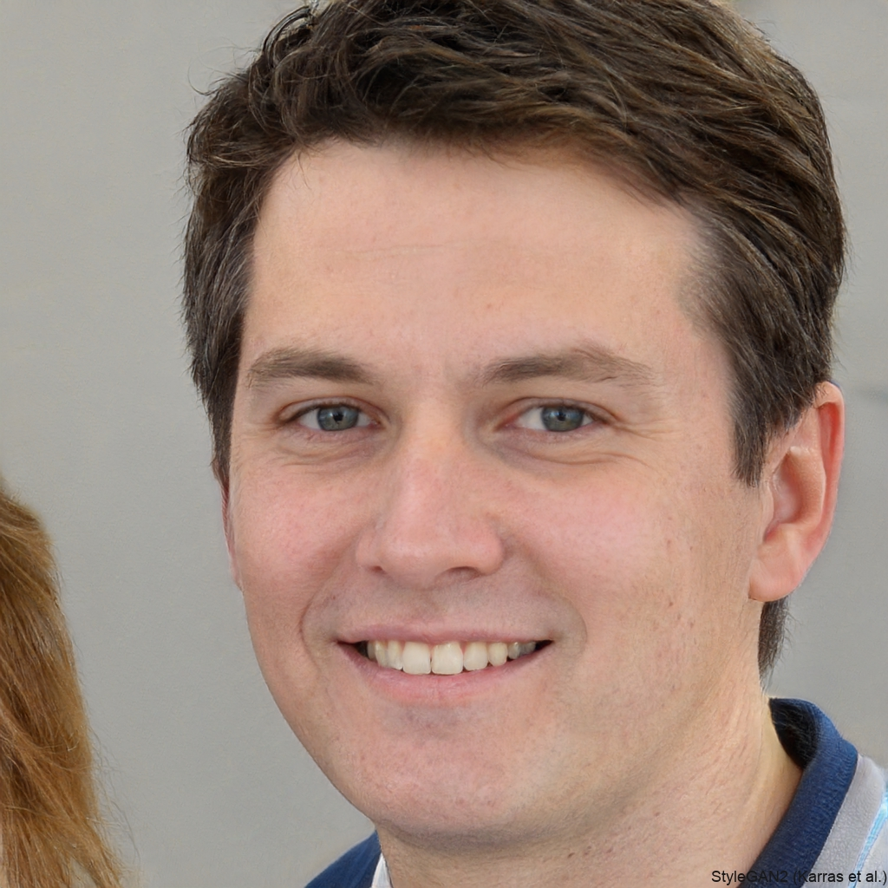

# Personas

## Ana Silva

- Cargo: Diretora
- Idade: 43
- Desafios:
  - Dificuldade em gerenciar os documentos e o processo de matrícula.
  - Dificuldade em gerenciar os pagamentos das matrículas.
  - Dificuldade em acessar informações sobre os alunos.
- Necessidades
  - Um sistema que centralize e facilite as tarefas administrativas.
  - Visualização organizada das informações de alunos, professores e mensalidades.
  - Funcionalidades simples para gerenciar turmas e alunos.

## Marcos Costa

- Cargo: Professor
- Idade: 28
- Desafios:
  - Dificuldade em acompanhar a presença e os dados dos alunos.
- Necessidades:
  - Uma plataforma fácil de usar para visualizar turmas e dados dos alunos.
  - Acesso a informações de presença e histórico de cada aluno.

## Júlio de Souza

- Cargo: Executivo
- Idade: 37
- Desafios:
  - Dificuldade em acompanhar a frequência e as atividades do filho.
  - Processos administrativos (matrícula, pagamentos) complicados.
- Necessidades:
  - Acesso às informações sobre a presença e atividades do filho.
  - Facilidade para acompanhar pagamentos.
  - Comunicação com a escola facilitada.
