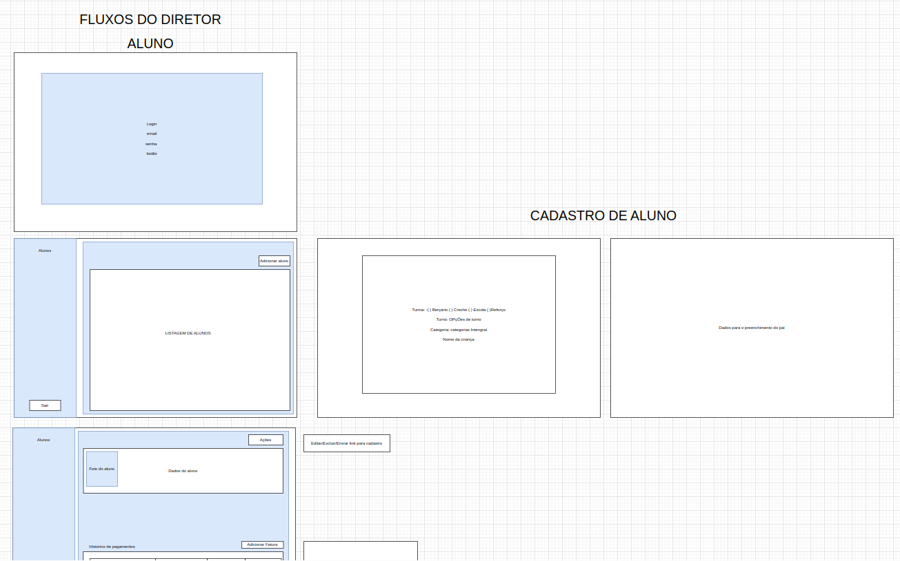

# **Prototipos**

## **Introdução**

Este documento tem como finalidade apresentar os protótipos desenvolvidos para o projeto Infantio. O protótipo de baixa fidelidade teve como principal objetivo validar os fluxos das funcionalidades previstas, sendo utilizado tanto para demonstração interna à equipe do projeto quanto para apresentação à stakeholder.

Por sua vez, o protótipo de alta fidelidade foi igualmente apresentado à stakeholder, visando validar a paleta de cores, o layout e as informações exibidas. Além disso, serviu como guia de desenvolvimento para os integrantes da equipe técnica.

## **Baixa fidelidade**

O protótipo de baixa fidelidade foi desenvolvido utilizando a ferramenta Draw.io. Abaixo, são apresentados alguns exemplos em forma de capturas de tela.

O arquivo completo pode ser [baixado aqui](../assets/jornada.drawio)

## **Alta fidelidade**

O protótipo de alta fidelidade foi desenvolvido utilizando a ferramenta Figma e pode ser acessado através do seguinte [link](https://www.figma.com/design/NIi2kqDpO6qGrVRUIOA6g2/Documenta%C3%A7%C3%A3o---Prot%C3%B3tipos---Infantio?node-id=1-3&node-type=canvas&t=0NfbFNcSzpKmGGV7-0)

