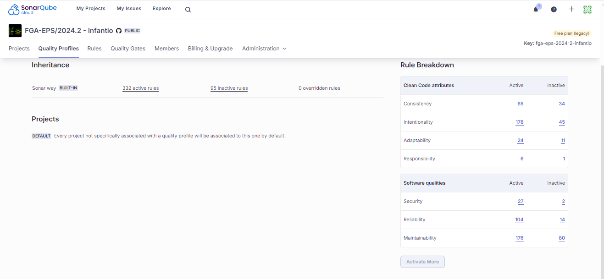
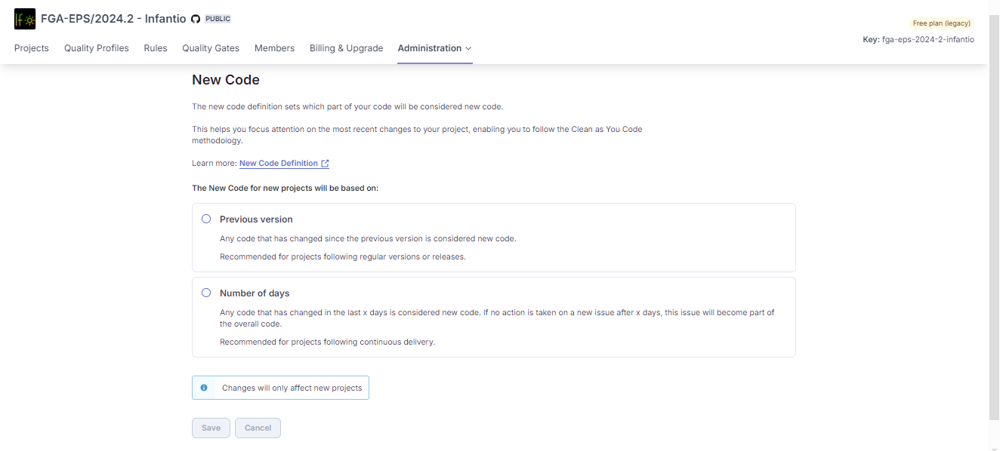

# 1 - Sobre a infraestrutura

O servidor para infraestrutura escolhido foi o Google Cloud Plataform(GCP). As motivações que embasam essa escolha são custo, simplicidade, familiaridade, além da estrutura robusta e confiável da Google. Nessa infraestrutura, é possível associar outros serviços e API's do GCP com o projeto, estruturando e evoluindo mais ainda as possibilidades e o alcance do projeto. 

O serviço do GCP escolhido foi o Compute Engine, que realiza a provisão de máquinas virtuais, com diversas possibilidades de RAM, Disco, tipo de máquina, otimização do comportamento e perfil do processamento, sistema operacional, e funções adicionais como: inicialização por imagens prévias, associação com Load Balacing, serviços de análise e inteligência. Há possibilidades de migração para o serviço de Kubernets do GCP(GKE), futuramente, em caso de maiores investimentos externos e pós-disciplina. 

# 2 - Custos

A política inicial do projeto, a respeito dos custos, é a busca pelo gasto mínimo para execução da primeira versão do projeto - quando não "free tier". Como o grupo contém 15 integrantes, entende-se que o valor de contribuição será melhor diluído. 

O planejamento para a estrutura do deploy que comportá o projeto foi inicialmente desenhado para: Uma maquína Virtual com especificações: 1 vCPU, 4 GB de RAM e 20 GB de memória; Uma rede padrão para realizar a comunicação, e Regras no Firewall. Todo o sistema foi planejado para ser deployado em apenas uma máquina, ou seja: frontend, backend e banco. Tecnicamente, é arriscado deployar uma estrutura assim, porque em caso de desastre, considerando um caso simplista sem backup ou cópias estruturais em zonas diferentes, há dois prejuízos: Prejuízo estrutural, onde a estrutura criada pode ser perdida; e prejuízo com o cliente, já que o serviço vai ficar fora do ar e o cliente perderá recursos. A forma mais correta de se deployar uma estrutura assim seria com uma máquina para cada parte desse projeto, e o backend associado com o próprio serviço de banco relacional que o GCP possui, o Cloud SQL. Desacoplar esse sistema, mas manter a comunicação de forma forte e estruturada é ideal. No nosso caso, o projeto ainda não possui alta demanda de acessos, nem é tão robusto ao ponto de necessitar esse tipo de estrutura. Portanto, definimos esse estado planejado como o mais aceitável e econômico. O valor obtido especifica uma máquina ligada 24/7 utilizando todos seus recursos.

Devido a alterações na estrutura do projeto, foi necessário alocar memória adicional para comportar a execução. Atualmente, as especificações da máquina continuam as mesmas, com exceção da memória que partiu de 20GB para 100GB. A Google cobra atualmente(Dezembro/2024) aproximadamente 1 dólar a mais para cada 10GB, e no momento da necessidade de extesão de memória, teve uma perda considerável de tempo para consertar e reestruturar a máquina. Portanto, justifica-se esse acréscimo em 80GB baseado no fator de custo: ainda encontra-se no nosso orçamento; e no fator expansividade: não queremos mais ter problemas próximos a datas importantes de ponto de controle. 

Valer ressaltar que, enquanto não há a entrega final do produto para o cliente e em épocas fora de avaliação, o ambiente de produção será desligado para economizar recursos. O Deploy continuará ocorrendo, mas sem tanta exposição da máquina. Por conta disso, o valor previsto na imagem pode ser menor, porém nunca extrapolando o máximo previsto.

Com relação a custos é isso. Por ter aporte inicial do próprio grupo, foi tudo bastante planejado para evitar surpresas desagradáveis e não pesarpara ninguém. 

Atualmente, os custos previstos se encontram em:

# 3 - A Estrutura Interna

O Projeto consta com duas execuções de dockercompose para cada frente. São 6 imagens para o backend: Microserviço Usuários, Microserviço Aplicação, Banco Usuários, Banco Aplicação, NATS, Microserviço API Gateway; e apenas 1 imagem para o frontend: Frontend. No momento há duas ativações via docker-compose. Inicialmente, apenas 1 docker-compose foi planejado. Para o frontend não havia necessidade, porque não há nada mais acoplado que seja importante subir junto desse serviço. Entretanto, para resolulção de problemas no período de testes, incorpou-se o docker-compose para o frontend. A motivação foi que o frontend não estava "segurando" no deploy, depois de minutos deployado, apenas o backend ficava no ar e o frontend caia. Isso tem a ver com a sessão de usuário dentro das máquinas virtuais. Se fosse usado docker-compose, e o serviço rodando por trás como o backend, solucionária esse problema.

Com isso em mente, alteramos apenas a versão deployada para conter um docker-compose ativo no frontend. E isso resolveu todos os problemas encontrados. Atualmente, basta acessar o ip da máquina na porta 3000, e pronto. 

# 4 - Sobre a esteira de processos CI/CD

O projeto consta com esteiras de CI planejadas e estruturadas para Backend e Frontend, e esteiras de CD planejadas porém não estruturadas ainda.

# 5 - Sonar

O projeto consta o uso do sonar, no qual o mesmo serve para verificar possíveis problemas com o código e aumentar a qualidade do mesmo, entretanto, durante a jornada para o uso existiram alguns problemas para o seu uso.

## 5.1 - Sonarqube

O Sonarqube foi a primeira ferramenta escolhida para uso nos repositórios, entretanto para realizar sua configuração era necessário muito esforço para configurar primeiro uma versão local, para depois configurar uma versão online, esta última que exigiria subir um sítio virtual próprio, o que geraria gastos, como alternativa a essas dificuldades, foi a utilização do sonarcloud.

## 5.1 - Sonarcloud

O Sonarcloud foi a ferramenta definitiva escolhida para uso na análise de código devido a sua facilidade de configuração, bastando inicialmente selecionar a organização onde os repositórios estão para realizar a análise, no qual a mesma pode realizar a filtragem de quais repositórios dessa organização selecionada você quer filtrar.

Após tudo isso selecionado, autorizado pelos administradores da organização e configurado, poderá ser visto os repositórios, no qual dentro desses é possível ver as chaves que identificam cada um deles para realizar outras ações, dentro do repositório é possível verificar algumas ações principais como a qualidade do código e issues, que aqui são entendidas como problemas encontrados na qualidade do código.  

Um ponto de destaque são as regras de qualidade e como é feito a análise do código, as regras de qualidade são as definidas por padrão pelo sonar, elas já cobrem grande parte do projeto, e quando uma issue aparece essa mesma indica qual é o erro, o que ele causa e como resolvê-lo, o que pode aumentar o conhecimento do desenvolvedor ou analista, quando outros erros parecidos acontecerem e como solucioná-los.

Sobre a análise de código, atualmente ele é feita quando código novo é adicionado, para fins de uma agilidade maior no momento atual do projeto a main e suas branchs estão sendo analisadas, entretanto se alguma dessas últimas for apagada, essas análise não ocorrerá. Mas os problemas de issue que vão painel principal vem somente do conteúdo que está 'main' ou raíz do projeto, assim não ocorre de ter que solucionar um problema que já foi resolvido, mas está em outra branch. 

