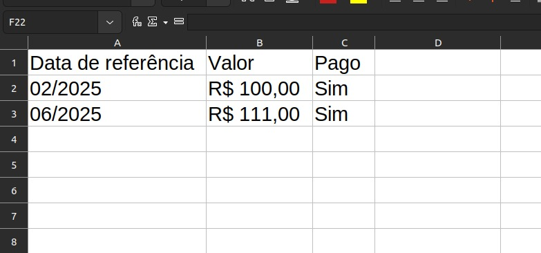
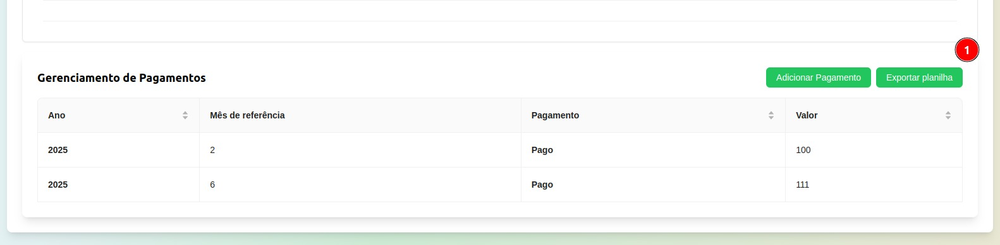

# Semana 1 - 12/01 até 20/01

Na entrega da primeira semana, optamos por desenvolver a funcionalidade de exportar as mensalidades de um aluno para o formato de planilha. A planilha inclui os seguintes dados:

- Data de referência;

- Valor da mensalidade;

- Status de pagamento (pago ou pendente).

## Objetivos da funcionalidade

O principal objetivo dessa funcionalidade é permitir ao diretor exportar os dados das mensalidades de maneira prática e organizada. Isso pode ser útil em diversas situações, como:

- Atender solicitações de pais ou responsáveis que desejem consultar o histórico de pagamentos;

- Finalidades fiscais, como comprovações ou declarações;

- Integração ou importação dos dados para outras ferramentas de gestão administrativa.

## Screenshots

## Responsáveis

Implementação:

- Vitor Manoel Aquino de Brito
- Victor Eduardo Araujo Ribeiro
- Pedro de Miranda Haick

Revisão:

- Lucas Lopes Frazão
