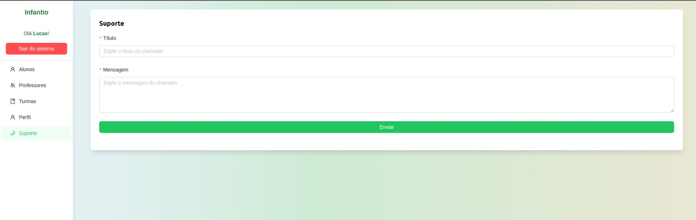
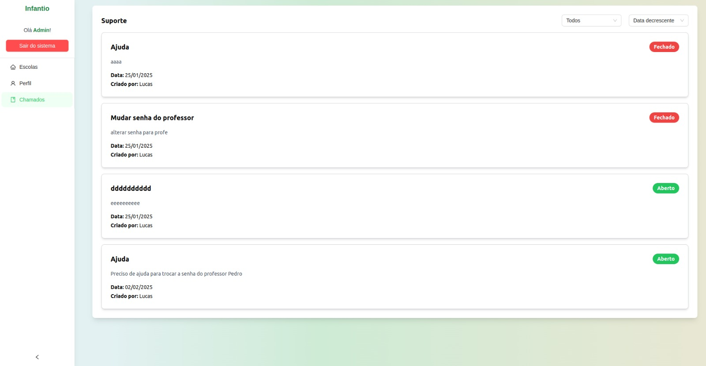
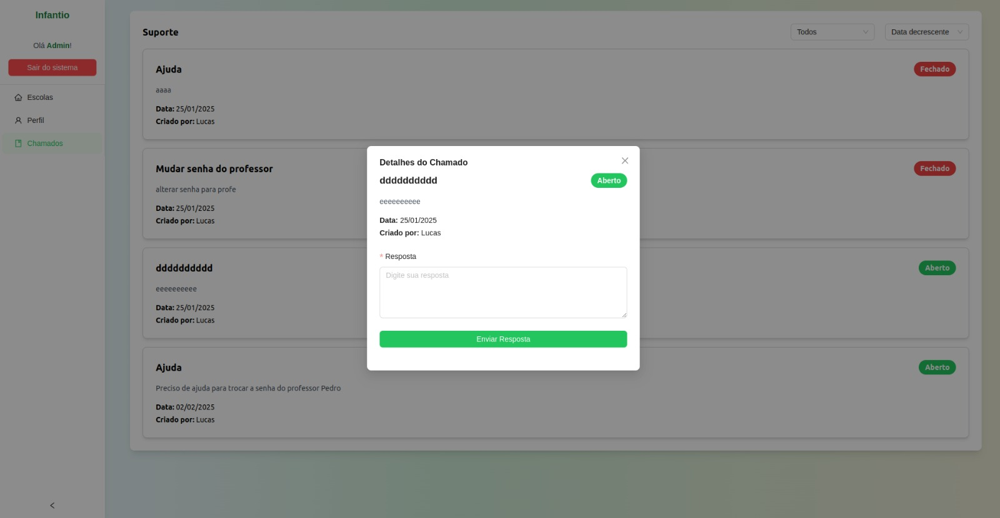

# Semana 2 - 19/01 até 27/01

Na segunda semana de desenvolvimento, implementamos a funcionalidade de suporte ao usuário. Com essa funcionalidade, os usuários podem abrir chamados para os administradores, permitindo que perguntem sobre qualquer aspecto do sistema ou solicitem assistência. Além disso, os administradores têm acesso a uma visão consolidada de todos os chamados abertos, facilitando a gestão e resolução das solicitações.

## Objetivos da funcionalidade

O principal objetivo dessa funcionalidade é oferecer um canal eficiente de comunicação entre os usuários e a equipe de suporte, garantindo que dúvidas sejam esclarecidas rapidamente e problemas possam ser resolvidos sem impactar o fluxo de trabalho. Exemplos de situações em que os usuários podem utilizar essa funcionalidade incluem:

- Problemas técnicos: Se o usuário encontrar dificuldades ao acessar determinada funcionalidade do sistema, como erro ao salvar um formulário ou falha no login.

- Solicitação de informações: Caso o usuário precise de orientações sobre o uso de um módulo específico ou queira saber mais sobre permissões de acesso.

- Reportar bugs: Para informar sobre falhas no sistema, como lentidão em determinadas ações ou comportamento inesperado de alguma funcionalidade.

- Solicitação de novas funcionalidades: Os usuários podem sugerir melhorias ou a inclusão de novas opções dentro do sistema.

## Screenshots

## Responsáveis

Implementação:

- Mateus Caltabiano Neves Frauzino
- Joao Victor Correia de Oliveira
- Matheus Soares Arruda

Revisão:

- Lucas Lopes Frazão
