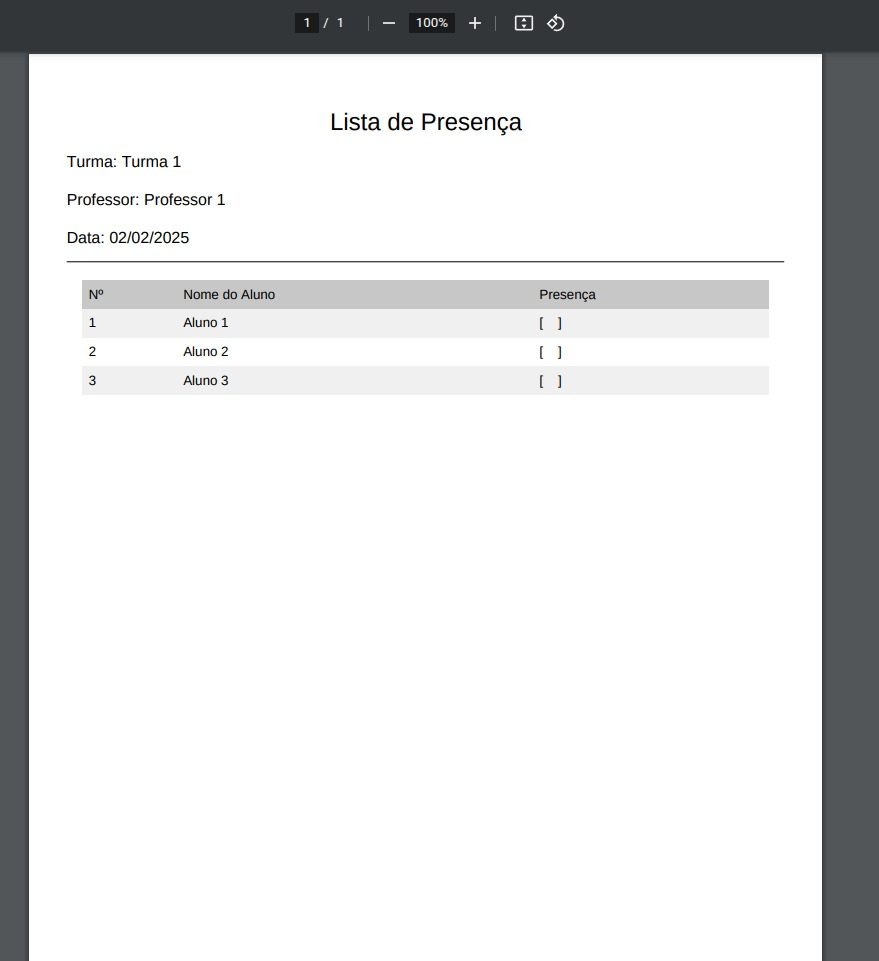
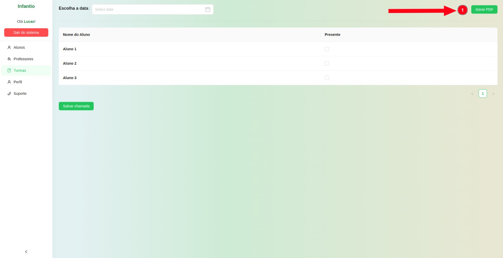

# Semana 3 - 27/01 até 03/02

Na terceira semana de desenvolvimento, implementamos a funcionalidade de geração de PDF da lista de chamada, semelhante ao recurso disponível no sistema SIGAA. Essa funcionalidade permite que os professores gerem e imprimam listas de presença para uso offline.

## Objetivos da funcionalidade

O principal objetivo dessa funcionalidade é permitir que os professores imprimam uma lista de chamada para preenchimento manual, facilitando o acompanhamento da presença dos alunos. Exemplos de uso incluem:

- Registro manual de presença: O professor pode utilizar a lista impressa para marcar a presença dos alunos em sala de aula e posteriormente lançar os dados no sistema.

- Backup físico: Em casos onde o sistema esteja indisponível, o professor pode utilizar a versão impressa como registro temporário até que possa atualizar os dados online.

## Screenshots

## Responsáveis

Implementação:

- Guilherme Keyti Cabral Kishimoto
- Matheus Calixto Vaz Pinheiro
- Felipe Alef Pereira Rodrigues

Revisão:

- Lucas Lopes Frazão
