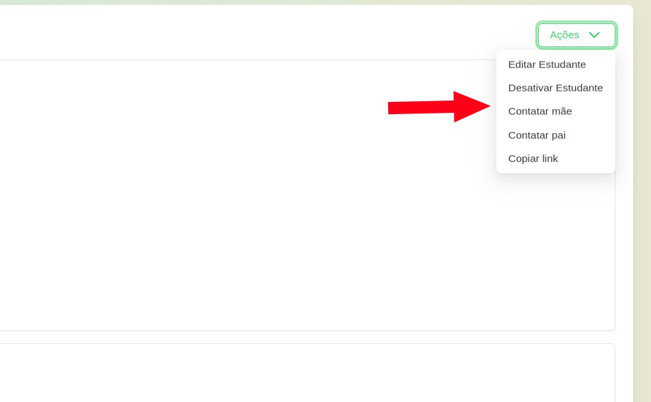
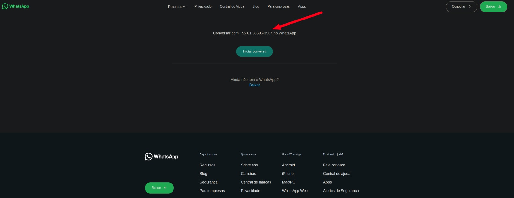

# Semana 4 - 03/02 até 10/02

Na quarta semana, implementamos a opção de mandar mensagem para os responsáveis do aluno, assim, a diretora pode entrar dentro das informações de um aluno e escolher a opção de mandar mensagem, abrindo a API do whatsapp.

## Objetivos da funcionalidade

- Mensagem para o responsável do aluno: O diretor pode enviar uma mensagem diretamente para o responsável do aluno, facilitando a comunicação entre os pais e os professores.

## Screenshots

## Responsáveis

Implementação:

- Lucas Lopes Frazão
