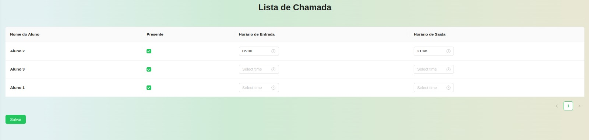

# Semana 5 - 10/02 até 14/02

Na quinta e última semana, implementamos a opção de colocar o horário de entrada e saída nos alunos, facilitando o acompanhamento do tempo de presença.

## Objetivos da funcionalidade

O principal objetivo dessa funcionalidade é permitir que os professores imprimam uma lista de chamada para preenchimento manual, facilitando o acompanhamento da presença dos alunos. Exemplos de uso incluem:

- Registro manual de presença: O professor pode utilizar a lista impressa para marcar a presença dos alunos em sala de aula e posteriormente lançar os dados no sistema.

## Screenshots

## Responsáveis

Implementação:

- Lucas Lopes Frazão